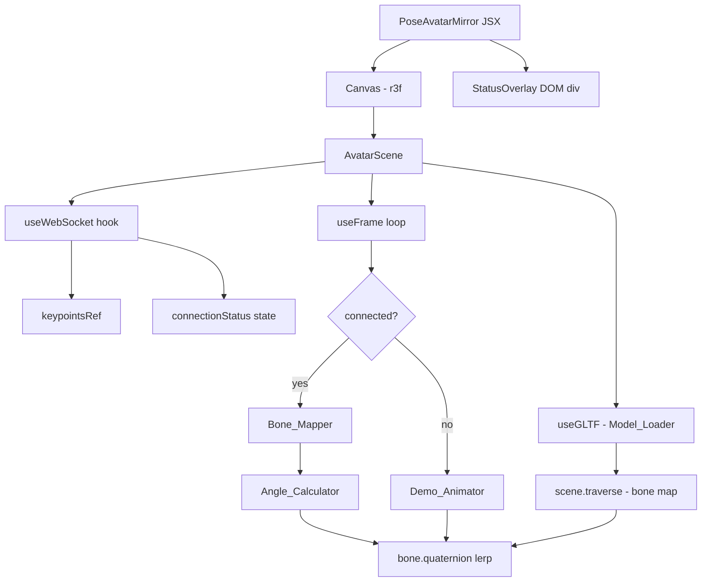

# Design Document: pose-3d-avatar-mirror

## Overview

`PoseAvatarMirror` is a self-contained React component that renders a Mixamo-rigged 3D humanoid avatar and drives its bone rotations in real time from COCO keypoints received over WebSocket. When no WebSocket connection is active the component falls back to a built-in sine-wave squat loop so the avatar is always animated.

The component is built on:
- **@react-three/fiber** — React renderer for Three.js, provides `useFrame` for the per-frame animation loop
- **@react-three/drei** — `useGLTF` for GLB loading, `OrbitControls` for optional camera interaction
- **Three.js** — quaternion / Euler math, bone traversal
- **Native WebSocket API** — no extra library needed

Key data flow:

```
YOLO backend
    │  ws://localhost:8765
    ▼
useWebSocket hook  ──► keypointsRef (latest frame, no re-render)
    │
    ▼
useFrame (60 fps)
    │
    ├─► Bone_Mapper  ──► Angle_Calculator ──► Euler ──► lerp ──► bone.quaternion
    │
    └─► Demo_Animator (when disconnected) ──► sine wave ──► bone.quaternion
```

Connection state drives a status overlay ("Connecting" | "Live" | "Demo Mode") rendered as a DOM overlay on top of the Canvas.

---

## Architecture



### Module Breakdown

| Module | File location | Responsibility |
|---|---|---|
| `PoseAvatarMirror` | `src/PoseAvatarMirror.jsx` | Root component, Canvas wrapper, status overlay, prop API |
| `AvatarScene` | inline in same file | r3f scene graph, wires hooks together |
| `useWebSocket` | inline hook | WS lifecycle, reconnect timer, message parsing |
| `Bone_Mapper` | `applyPose()` function | Keypoint → angle → Euler → lerp → quaternion |
| `Angle_Calculator` | `calculateAngle()` function | Law-of-cosines angle from 3 (x,y) points |
| `Demo_Animator` | `applyDemo()` function | Sine-wave squat driven by elapsed time |

Everything lives in a single file to keep the component self-contained and drop-in friendly.

---

## Components and Interfaces

### PoseAvatarMirror (root component)

```jsx
<PoseAvatarMirror
  wsUrl="ws://localhost:8765"   // string, default "ws://localhost:8765"
  modelPath="/Idle.glb"         // string, default "/Idle.glb"
  confidenceThreshold={0.5}     // number 0–1, default 0.5
  smoothing={0.15}              // number 0–1, default 0.15
  width="100%"                  // string|number, default "100%"
  height="100%"                 // string|number, default "100%"
/>
```

Renders a `<div>` sized to `width × height` containing:
1. `<Canvas>` (r3f) — fills the div
2. `<StatusOverlay>` — absolute-positioned DOM div in the top-left corner

### useWebSocket(url)

```js
const { keypointsRef, status } = useWebSocket(wsUrl)
```

- `keypointsRef` — `React.useRef` holding the latest `{ keypoints, confidence }` or `null`
- `status` — `"connecting" | "live" | "demo"` React state (triggers overlay re-re
`keypointsRef.current`; bail if null or confidence below threshold
2. Normalize all keypoints: `x /= 640, y /= 640`
3. Mirror x: `x = 1 - x`
4. Invert y for Three.js: `y = 1 - y`
5. For each bone mapping entry, call `calculateAngle` with the three relevant keypoints
6. Convert angle to `THREE.Euler` on the correct axis
7. Convert to `THREE.Quaternion` target
8. `bone.quaternion.slerp(target, smoothing)` — smooth interpolation each frame

### applyDemo(bonesRef, elapsedTime)

Called each frame when `status !== "live"`. Drives a squat loop:
- `squatAngle = Math.sin(elapsedTime * 1.2) * 0.4` (radians, ~0.4 rad ≈ 23°)
- Applies to hip and knee bones symmetrically

---

## Data Models

### Pose_Message (incoming WebSocket payload)

```ts
interface PoseMessage {
  keypoints: [number, number][]  // length 17, pixel coords in 640×640 space
  confidence: number             // 0.0 – 1.0
}
```

### COCO Keypoint Index Map

| Index | Name |
|---|---|
| 0 | nose |
| 1 | left_eye |
| 2 | right_eye |
| 3 | left_ear |
| 4 | right_ear |
| 5 | left_shoulder |
| 6 | right_shoulder |
| 7 | left_elbow |
| 8 | right_elbow |
| 9 | left_wrist |
| 10 | right_wrist |
| 11 | left_hip |
| 12 | right_hip |
| 13 | left_knee |
| 14 | right_knee |
| 15 | left_ankle |
| 16 | right_ankle |

### Bone Mapping Table

This is the core lookup table used by `applyPose`. Each row defines one bone update.

| Bone name (Mixamo) | Proximal KP | Middle KP | Distal KP | Rotation axis | Notes |
|---|---|---|---|---|---|
| `mixamorigLeftArm` | 11 (l_hip) | 5 (l_shoulder) | 7 (l_elbow) | Z | shoulder abduction |
| `mixamorigLeftForeArm` | 5 (l_shoulder) | 7 (l_elbow) | 9 (l_wrist) | Z | elbow flex |
| `mixamorigRightArm` | 12 (r_hip) | 6 (r_shoulder) | 8 (r_elbow) | Z | shoulder abduction |
| `mixamorigRightForeArm` | 6 (r_shoulder) | 8 (r_elbow) | 10 (r_wrist) | Z | elbow flex |
| `mixamorigLeftUpLeg` | 5 (l_shoulder) | 11 (l_hip) | 13 (l_knee) | X | hip flex |
| `mixamorigLeftLeg` | 11 (l_hip) | 13 (l_knee) | 15 (l_ankle) | X | knee flex |
| `mixamorigRightUpLeg` | 6 (r_shoulder) | 12 (r_hip) | 14 (r_knee) | X | hip flex |
| `mixamorigRightLeg` | 12 (r_hip) | 14 (r_knee) | 16 (r_ankle) | X | knee flex |

Angle-to-Euler convention: `angle_rad = (180 - angleDeg) * (π/180)` so that a straight limb (180°) maps to 0 rotation and a fully bent limb maps to maximum rotation.

### Bone Discovery (runtime)

```js
// Populated once after GLB loads
const bonesRef = useRef({})

useEffect(() => {
  scene.traverse((obj) => {
    if (obj.isBone) bonesRef.current[obj.name] = obj
  })
}, [scene])
```

### Connection Status State Machine

```
         mount
           │
           ▼
      "connecting"
      /           \
  WS open       WS error / close
     │                │
     ▼                ▼
   "live"    ──►  "connecting"  (after 3s timer)
                      │
              no WS after timeout
                      │
                      ▼
                   "demo"
```

In practice `status` is set to `"demo"` immediately when the socket closes, and back to `"connecting"` when a reconnect attempt starts.


---

## Correctness Properties

*A property is a characteristic or behavior that should hold true across all valid executions of a system — essentially, a formal statement about what the system should do. Properties serve as the bridge between human-readable specifications and machine-verifiable correctness guarantees.*

### Property 1: Valid pose messages are always parsed correctly

*For any* JSON string that contains a `keypoints` array of exactly 17 `[x, y]` pairs and a numeric `confidence` field, the WebSocket message handler SHALL extract those values without error and store them in `keypointsRef`.

**Validates: Requirements 2.2**

---

### Property 2: Invalid messages are always discarded

*For any* WebSocket message that is not valid JSON, or whose `keypoints` array has a length other than 17, or that is missing the `keypoints` field entirely, the handler SHALL not update `keypointsRef` and SHALL not throw an unhandled exception.

**Validates: Requirements 2.3**

---

### Property 3: Angle calculator correctness

*For any* three 2D points A, B, C (with B as the vertex), `calculateAngle(A, B, C)` SHALL return a value in the range [0°, 180°]. Additionally, when A, B, C are collinear (straight limb), the result SHALL be 180°, and when the vectors BA and BC are perpendicular, the result SHALL be 90°.

**Validates: Requirements 3.2**

---

### Property 4: All mapped bones are updated on every valid pose frame

*For any* valid `PoseMessage` with `confidence ≥ confidenceThreshold`, calling `applyPose` SHALL update the quaternion of every bone listed in the bone mapping table (all 8 bones: left/right arm, forearm, upLeg, leg).

**Validates: Requirements 3.1, 3.3–3.11**

---

### Property 5: Coordinate transform correctness

*For any* keypoint with pixel coordinates `(px, py)` in the range `[0, 640]`, the normalized and mirrored result SHALL satisfy: `x_out = 1 - (px / 640)` (x mirrored) and `y_out = 1 - (py / 640)` (y inverted). Both output values SHALL lie in `[0, 1]`.

**Validates: Requirements 3.12, 5.1, 5.2**

---

### Property 6: Confidence filter blocks low-confidence updates

*For any* `PoseMessage` with `confidence < confidenceThreshold`, calling `applyPose` SHALL leave all bone quaternions unchanged from their values before the call.

**Validates: Requirements 6.1**

---

### Property 7: Smoothing moves each bone toward its target

*For any* bone with current quaternion `q_current` and target quaternion `q_target`, and smoothing factor `s ∈ (0, 1)`, the result of one smoothing step SHALL be strictly closer (in quaternion distance) to `q_target` than `q_current` was. When `s = 1.0`, the result SHALL equal `q_target` exactly.

**Validates: Requirements 8.1, 8.4**

---

### Property 8: Per-bone smoothing independence

*For any* set of bones with distinct current and target quaternions, applying the smoothing step to one bone SHALL NOT change the quaternion of any other bone.

**Validates: Requirements 8.5**

---

### Property 9: Demo animator output is bounded by sine amplitude

*For any* elapsed time `t`, the rotation values produced by `applyDemo` for hip and knee bones SHALL lie within `[-0.4, 0.4]` radians (the sine wave amplitude used for the squat loop).

**Validates: Requirements 4.2**

---

## Error Handling

| Scenario | Handling |
|---|---|
| GLB fails to load | `useGLTF` error caught via React error boundary or Suspense fallback; render `<ErrorFallback>` with message |
| GLB still loading | React `<Suspense fallback={<LoadingIndicator />}>` wraps the model component |
| WebSocket message is invalid JSON | `try/catch` in `onmessage`; log `console.warn`; skip frame |
| `keypoints` array wrong length | Guard check after parse; log `console.warn`; skip frame |
| Bone not found in GLB | `bonesRef.current[name]` is `undefined`; guard with `if (!bone) return` per bone |
| WebSocket closes unexpectedly | `onclose` handler sets status to `"demo"`, schedules reconnect after 3 s via `setTimeout` |
| Component unmounts during reconnect | `useEffect` cleanup clears the `setTimeout` ref and calls `ws.close()` |
| `calculateAngle` receives coincident points (zero-length vector) | Denominator guard: if `|BA| * |BC| < ε`, return `180` (treat as straight limb) |

---

## Testing Strategy

### Dual Testing Approach

Both unit tests and property-based tests are required. They are complementary:
- **Unit tests** cover specific examples, integration points, and error conditions
- **Property tests** verify universal invariants across randomized inputs

### Property-Based Testing Library

Use **fast-check** (JavaScript/TypeScript PBT library):

```bash
npm install --save-dev fast-check
```

Each property test runs a minimum of **100 iterations** (fast-check default is 100; set `numRuns: 100` explicitly).

Each property test MUST include a comment tag in the format:
`// Feature: pose-3d-avatar-mirror, Property N: <property_text>`

### Property Tests

| Design Property | Test description | fast-check arbitraries |
|---|---|---|
| Property 1 | Valid messages always parsed | `fc.array(fc.tuple(fc.float(), fc.float()), {minLength:17, maxLength:17})` + `fc.float()` for confidence |
| Property 2 | Invalid messages always discarded | `fc.oneof(fc.string(), fc.array(..., {minLength:0, maxLength:16}))` |
| Property 3 | Angle in [0°,180°], collinear=180°, perpendicular=90° | `fc.tuple(fc.float(), fc.float())` × 3 |
| Property 4 | All 8 bones updated on valid frame | `fc.array(fc.tuple(fc.float({min:0,max:640}), fc.float({min:0,max:640})), {minLength:17,maxLength:17})` |
| Property 5 | Coordinate transform correctness | `fc.tuple(fc.float({min:0,max:640}), fc.float({min:0,max:640}))` |
| Property 6 | Low-confidence frames leave bones unchanged | `fc.float({min:0, max:0.499})` for confidence |
| Property 7 | Smoothing moves toward target; s=1 snaps | `fc.float({min:0,max:1})` for smoothing factor |
| Property 8 | Per-bone independence | `fc.array(fc.record({name: fc.string(), q: quaternionArb}))` |
| Property 9 | Demo output bounded by ±0.4 rad | `fc.float({min:0, max:1000})` for elapsed time |

### Unit Tests

Focus on specific examples and integration points:

- **Model loading**: renders `<LoadingIndicator>` while GLB loads; renders `<ErrorFallback>` on load failure
- **WebSocket lifecycle**: WebSocket constructed with correct URL on mount; `ws.close()` called on unmount; reconnect timer fires after 3 s on close
- **Status overlay**: renders "Connecting" on mount, "Live" when WS opens, "Demo Mode" when WS closes
- **Demo mode activation**: bone rotations change over time when status is "demo"
- **Demo mode deactivation**: bone rotations stop changing when WS connects
- **Prop defaults**: rendering without props uses `ws://localhost:8765`, `/Idle.glb`, threshold `0.5`, smoothing `0.15`
- **confidenceThreshold prop**: custom threshold value is respected
- **smoothing prop**: custom smoothing value is passed through to lerp
- **Canvas sizing**: Canvas element matches `width`/`height` props

### Test File Structure

```
frontend/src/
  PoseAvatarMirror.jsx
  __tests__/
    PoseAvatarMirror.unit.test.jsx   # unit tests (vitest + @testing-library/react)
    PoseAvatarMirror.pbt.test.js     # property-based tests (vitest + fast-check)
    calculateAngle.test.js           # pure function tests
```

### Mocking Strategy

- Mock `useGLTF` from `@react-three/drei` to return a fake scene with stub bones
- Mock `@react-three/fiber` Canvas to render children directly (avoid WebGL in test env)
- Use `vi.useFakeTimers()` for reconnect timer tests
- Use a mock WebSocket class to control `onopen`, `onmessage`, `onclose` events
